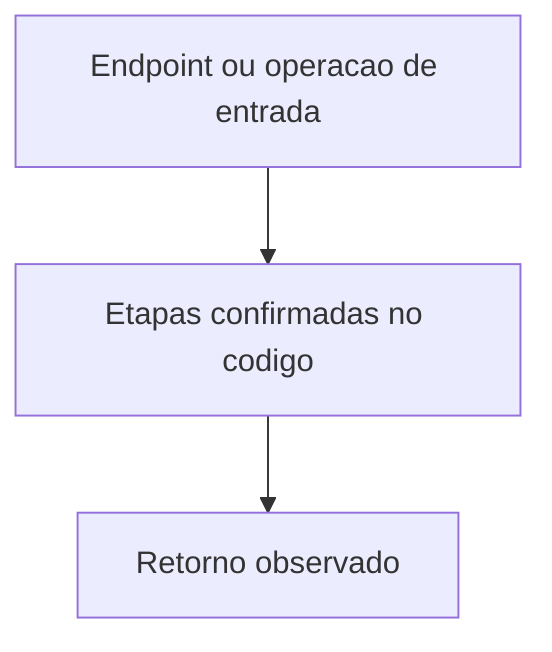
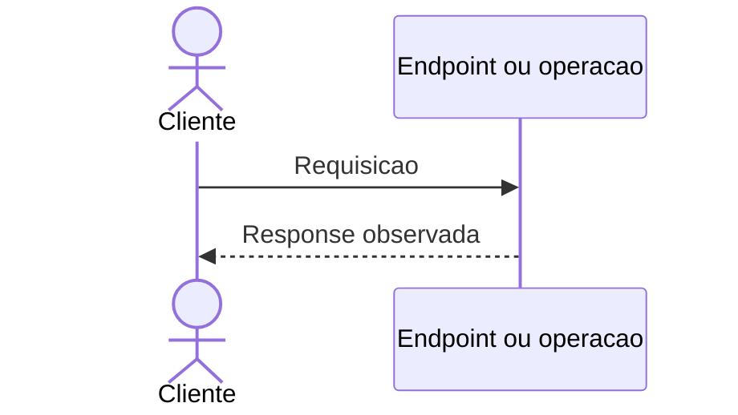

# Mapeamento de fluxo

Mapeamento de fluxo de um microserviço ou lib

## Escopo

- Projeto: `<projeto ou Nao aplicavel>`
- Serviço ou biblioteca: `<nome>`
- Repositório: `<caminho no workspace>`
- Endpoint ou operação: `<metodo e caminho ou nome da operacao>`
- Branch: `<git branch analisada ou NAO VERIFICADO>`

## Entradas

- Método e caminho do endpoint ou operação de entrada
- Parâmetros de rota, query, headers e corpo, conforme identificados
- Restrições de autenticação/autorização observadas, quando aplicável

## Contratos

- Request de entrada: `<método, caminho, query, headers, content type e corpo conforme expostos>`
- Response de saída: `<status, headers, content type e corpo conforme expostos>`
- Chamadas downstream: `<serviço/operação e request/response observados>`

## Chamada cURL observada

Incluir um comando cURL completo e copiável para cada endpoint, com método, URL, query e headers necessários. Quando houver corpo, incluir no cURL o `Content-Type` e o corpo com os campos e valores conforme os exemplos do repositório. Para valores dinâmicos, usar placeholder descritivo e indicar de onde obtê-lo, como o token retornado pelo login ou recebido por e-mail. Quando não houver corpo, declarar isso e não incluir `-d`. Swagger/OpenAPI é fonte complementar opcional: consultar se existir, sem bloquear a análise quando estiver ausente; se divergir do código, registrar a divergência e priorizar o comportamento confirmado no código. Se não houver informação suficiente para montar a chamada, registrar `NAO LOCALIZADO`.

```sh
<chamada cURL conforme exemplo localizado>
```

## Fluxo interno

Descrever em ordem o processamento desde a entrada até o retorno. Incluir validações, decisões, transformações, persistência e chamadas externas somente quando localizadas nas fontes.

## Fluxograma

Representar a entrada, os passos internos relevantes, decisões, comunicações, caminhos de erro e retorno.



## Diagrama de Sequencia

Representar participantes, chamadas, respostas e retornos na ordem observada no código. Incluir caminhos de erro quando identificáveis.



## Erros e excecoes

- `<condicao, tratamento e retorno observados; ou NAO LOCALIZADO>`

## Observabilidade

- Logs, métricas, traces e identificadores de correlação encontrados: `<evidências ou NAO LOCALIZADO>`

## Referencias do codigo

|Arquivo e linha|Papel no fluxo|
|---|---|
|||

## Pendencias e limites do mapeamento

- Informação não confirmada: `<informação e motivo>`
- Próxima evidência necessária: `<evidência ou Nao aplicavel>`
