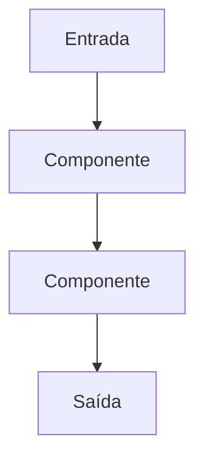
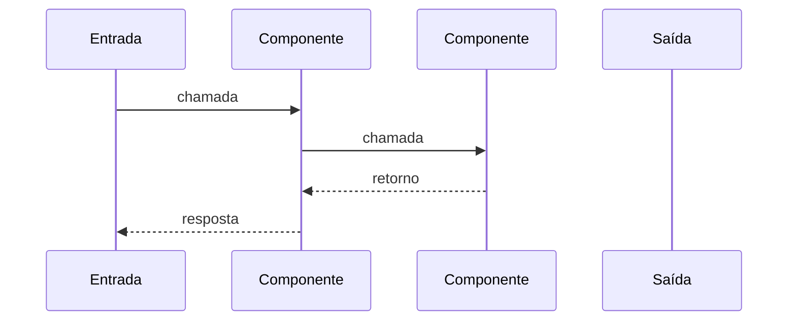

# Fluxo — <nome>

## Objetivo

<descrição breve da funcionalidade>

## Entrada

* <endpoint/evento/consumer/job>

## Flowchart

## Sequence

## Dependências

* <serviço>
* <banco>
* <evento/mensageria>

## Saída

* <resposta/resultado>

## Pontos desconhecidos

* <item>
