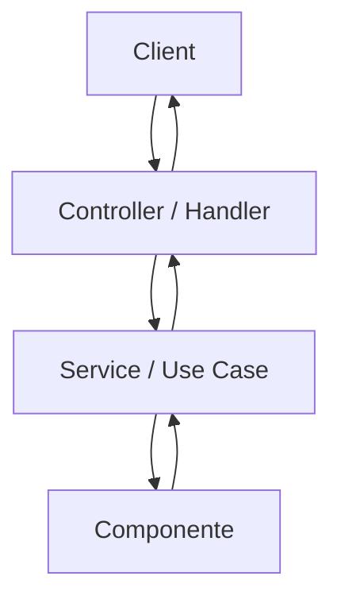
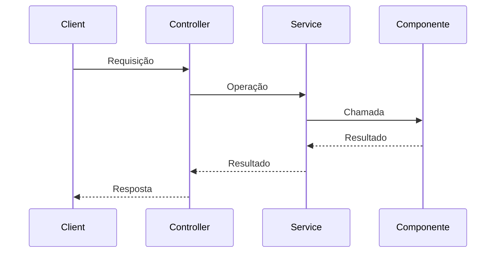

# Fluxo — <identidade>

## Objetivo

<Descrição objetiva da funcionalidade analisada.>

## Entrada

- Origem: <Client, evento, consumer, job, API pública etc.>
- Porta de entrada: <método + rota ou identificador>
- Payload/Entrada: <dados confirmados>
- Validação: <somente quando confirmada>
- Evidência: <arquivo — classe/método/trecho>

## Flowchart

## Sequence

## Dependências do Core

- <dependência externa concretamente confirmada>
- Evidência: <arquivo — classe/método/configuração relacionada>

## Aspectos Transversais

- <aspecto transversal confirmado>
- Efeito: <efeito confirmado>
- Evidência: <arquivo — classe/método>

## Saída

- Resultado: <resultado confirmado>
- HTTP: <código confirmado, quando aplicável>
- Payload: <resposta confirmada, quando aplicável>
- Evidência: <arquivo — classe/método/trecho>

## Erros

- Erro: <erro confirmado>
- Origem: <origem confirmada>
- Tratamento/Propagação: <comportamento confirmado>
- Resposta: <resposta confirmada>
- Evidência: <arquivo — classe/método/trecho>

## Pontos desconhecidos

- <somente informações necessárias ao entendimento do fluxo que não puderam ser confirmadas>
