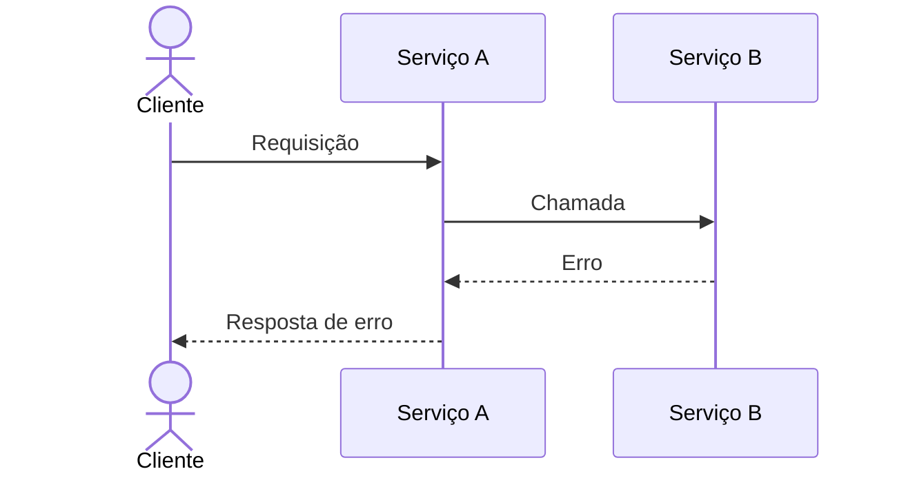

# Troubleshooting de erro

Troubleshooting de erro reportado em um microserviço, biblioteca ou fluxo entre serviços

## Escopo

- Projeto: `<projeto ou Nao aplicavel>`
- Serviços e bibliotecas candidatos: `<lista>`
- Repositórios: `<caminhos no workspace>`
- Branch: `<git branch analisada ou NAO VERIFICADO>`

## Pacote de evidência inicial

- trace_id: `<valor ou NAO INFORMADO>`
- conversation_id: `<valor ou NAO INFORMADO>`
- Serviço (Dynatrace/Java): `<nome ou NAO INFORMADO>`
- POD (ArgoCD): `<valor ou NAO INFORMADO>`
- Timestamp: `<valor ou NAO INFORMADO>`
- Log do erro capturado: `<texto ou NAO INFORMADO>`

## Relato original

- Canal: `<ex. Teams>`
- Mensagem do solicitante: `<texto conforme recebido>`

## Evidências analisadas

|Arquivo|Tipo|Origem|Observação|
|-------|----|------|----------|
|       |    |      |          |

## Loop de consultas DQL

Registrar cada rodada: a consulta proposta, o motivo e o resultado colado pelo usuário. Repetir até haver evidência suficiente para localizar o ponto de ruptura.

|Rodada|Consulta DQL|Motivo|Resultado colado pelo usuário|
|---|---|---|---|
|1||||

## Identificadores correlacionados

- trace_id: `<valor ou NAO LOCALIZADO>`
- conversation_id: `<valor ou NAO LOCALIZADO>`
- correlation_id: `<valor ou NAO LOCALIZADO>`
- Serviço(s) e POD(s) (ArgoCD): `<valores ou NAO LOCALIZADO>`
- Janela de tempo do incidente: `<inicio - fim ou NAO LOCALIZADO>`

## Ponto de ruptura

- `<log, trace ou evidência que evidencia onde o erro ocorreu>`

## Causa raiz

- Causa: `<serviço/trecho que originou o dado incorreto ou ausente>`
- Consequência: `<serviço/trecho onde a exceção estourou, quando distinto da causa>`

## Diagrama de sequência do erro



## Microsserviços e bibliotecas afetados

- `<nome e papel no fluxo, incluindo serviços anteriores que enviaram dado incorreto ou ausente>`

## Triagem de responsabilidade

- O serviço da causa raiz pertence à squad: `<sim/nao>`
- Se não pertencer, time ou serviço responsável para delegar: `<nome ou Nao aplicavel>`
- Ação decidida: `<corrigir nesta squad | delegar>`

## Reprodução do erro

- Fluxo lido até o ponto de entrada: `<referência de arquivo/linha>`
- Chamada cURL utilizada para reproduzir (uso no Bruno):

```sh
<curl completo com metodo, url, headers e corpo>
```

- Resultado da reprodução: `<confirmado / não reproduzido>`

## Correção aplicada

Preencher somente quando o serviço for da squad e a implementação tiver sido autorizada.

- Arquivo/classe/método alterado: `<referência>`
- Descrição da alteração: `<descrição>`
- Autorização registrada: `<data/confirmação do usuário>`

## Validação guiada

- Instruções de teste fornecidas ao usuário: `<passos>`
- Resultado do reteste: `<sucesso / ajuste necessário e o que foi ajustado>`
- Correção consolidada: `<confirmado pelo usuário ou Nao aplicavel>`

## Observabilidade da correção

- Log/métrica/trace pontual adicionado no trecho corrigido: `<descrição>`

## Consulta DQL para validar a correção

Usar após o deploy em homologação, com a observabilidade introduzida, para confirmar o sucesso no mesmo ambiente onde o erro ocorreu.

```text
<consulta DQL sugerida para validar sucesso ou Nao aplicavel>
```

## Report

### Report inicial (triagem)

Texto pronto para postar no chat do relator logo após a causa e a triagem serem confirmadas.

```text
<problema identificado, causa provável e se a correção será feita pela squad ou delegada>
```

### Report final (correção validada)

Texto pronto para o relator e para reaproveitar na mensagem de commit.

```text
<problema, causa raiz confirmada, correção aplicada e observabilidade introduzida>
```

## Pendências e limites da investigação

- Informação não confirmada: `<informação e motivo>`
- Próxima evidência necessária: `<evidência ou Nao aplicavel>`
