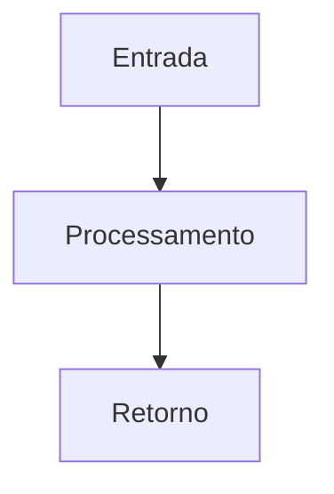
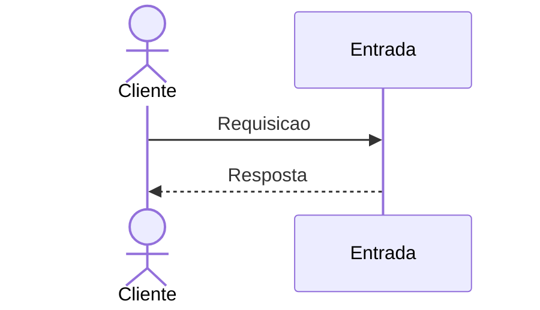

# Mapeamento de fluxo

## Escopo

- Projeto: `<projeto ou Nao aplicavel>`
- Serviço ou biblioteca: `<nome>`
- Repositório: `<caminho no workspace>`
- Endpoint ou operação: `<metodo e caminho ou nome da operacao>`
- Branch: `<git branch analisada ou NAO VERIFICADO>`

## Entradas

- Método e caminho: `<valor>`
- Parâmetros de rota, query e corpo: `<valores ou NAO APLICAVEL>`
- Autenticação e autorização: `<valores ou NAO LOCALIZADO>`

## Contratos

### Requisição

- Método: `<valor>`
- Caminho: `<valor>`
- Parâmetros: `<valores ou NAO APLICAVEL>`
- Headers: `<valores ou NAO APLICAVEL>`
- Payload JSON:

```json
{
    "<campo>": "<valor>"
}
```

### Resposta

- Status HTTP: `<valor ou NAO LOCALIZADO>`
- Payload JSON:

```json
{
  "<campo>": "<valor>"
}
```

## Chamada cURL (Bruno)

```sh
curl --request <METODO> \
    --url '<URL>' \
    --header 'Content-Type: application/json' \
    --data-raw '{
        "<campo>": "<valor>"
    }'
```

## Fluxo interno

PREENCHER

## Fluxograma



## Diagrama de Sequencia



## Comunicações e dependências

- Serviços e bibliotecas envolvidos: `<valores ou NAO LOCALIZADO>`
- Eventos e estados: `<valores ou NAO LOCALIZADO>`
- Processos assíncronos ou externos: `<valores ou NAO LOCALIZADO>`

## Erros e excecoes

- `<PREENCHER ou NAO LOCALIZADO>`

## Observabilidade

- Logs, métricas, traces e identificadores de correlação: `<valores ou NAO LOCALIZADO>`
