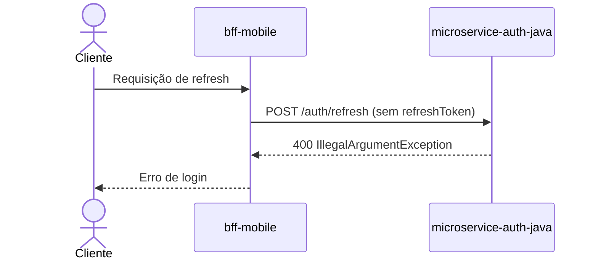

# Troubleshooting de erro

Troubleshooting de erro reportado em um microserviço, biblioteca ou fluxo entre serviços

## Escopo

- Projeto: `projeto-1`
- Serviços e bibliotecas candidatos: `microservice-auth-java`
- Repositórios: `dominios/projeto-1/srvs/microservice_auth_java`
- Branch: `main`

## Pacote de evidência inicial

- trace_id: `7f3e1a2b4c5d6e7f8091a2b3c4d5e6f7`
- conversation_id: `conv-9f8e7d6c5b4a`
- Serviço (Dynatrace/Java): `microservice-auth-java`
- POD (ArgoCD): `microservice-auth-java-7d5f9c6b8f-x2n4q`
- Timestamp: `2026-09-29T08:12:41Z`
- Log do erro capturado: `java.lang.IllegalArgumentException: refreshToken must not be blank (RefreshTokenService.java:42)`

## Relato original

- Canal: `Teams`
- Mensagem do solicitante: `ta dando erro no login, cliente não consegue autenticar desde hoje de manhã`

## Evidências analisadas

|Arquivo|Tipo|Origem|Observação|
|-------|----|------|----------|
|log-dynatrace.txt|log|Dynatrace|Exceção capturada no serviço, sem indicação ainda da origem do dado ausente|

## Loop de consultas DQL

|Rodada|Consulta DQL|Motivo|Resultado colado pelo usuário|
|---|---|---|---|
|1|`fetch logs \| filter matchesPhrase(dt.trace_id, "7f3e1a2b4c5d6e7f8091a2b3c4d5e6f7")`|Reconstruir o distributed trace completo do trace_id|Trace mostra chamada anterior do serviço `bff-mobile` sem o campo `refreshToken` no corpo|

## Identificadores correlacionados

- trace_id: `7f3e1a2b4c5d6e7f8091a2b3c4d5e6f7`
- conversation_id: `conv-9f8e7d6c5b4a`
- correlation_id: `NAO LOCALIZADO`
- Serviço(s) e POD(s) (ArgoCD): `microservice-auth-java-7d5f9c6b8f-x2n4q`, `bff-mobile-6b9c8d7f-k9p2t`
- Janela de tempo do incidente: `2026-09-29T08:12:30Z - 2026-09-29T08:12:41Z`

## Ponto de ruptura

- `RefreshTokenService.validate` lança `IllegalArgumentException` ao receber `refreshToken` vazio, conforme log-dynatrace.txt`

## Causa raiz

- Causa: `bff-mobile` envia a requisição de refresh sem o campo `refreshToken` quando o token local expira antes do esperado
- Consequência: `microservice-auth-java` estoura a exceção ao validar o campo ausente

## Diagrama de sequência do erro



## Microsserviços e bibliotecas afetados

- `bff-mobile`: origem do dado ausente, envia refresh sem o campo `refreshToken`
- `microservice-auth-java`: recebe o dado incompleto e estoura a exceção

## Triagem de responsabilidade

- O serviço da causa raiz pertence à squad: `nao`
- Se não pertencer, time ou serviço responsável para delegar: `squad mobile, dona do bff-mobile`
- Ação decidida: `delegar`

## Reprodução do erro

- Fluxo lido até o ponto de entrada: `RefreshTokenService.java:42`
- Chamada cURL utilizada para reproduzir (uso no Bruno):

```sh
curl -X POST https://localhost:8443/auth/refresh \
  -H "Content-Type: application/json" \
  -d '{}'
```

- Resultado da reprodução: `confirmado`

## Correção aplicada

Não aplicável nesta investigação: causa raiz é do `bff-mobile`, fora da squad.

## Validação guiada

Não aplicável nesta investigação.

## Observabilidade da correção

Não aplicável nesta investigação.

## Consulta DQL para validar a correção

```text
Nao aplicavel
```

## Report

### Report inicial (triagem)

```text
O erro de login reportado ocorre porque o serviço bff-mobile envia a requisição de refresh sem o campo refreshToken.
O microservice-auth-java apenas recebe o dado incompleto e rejeita a chamada corretamente.
A correção é de responsabilidade da squad mobile (bff-mobile); estamos delegando o caso para o time responsável.
```

### Report final (correção validada)

```text
Nao aplicavel: correção delegada à squad mobile, fora do escopo deste serviço.
```

## Pendências e limites da investigação

- Informação não confirmada: `correlation_id não localizado nas evidências disponíveis`
- Próxima evidência necessária: `confirmação da squad mobile sobre a correção aplicada no bff-mobile`
