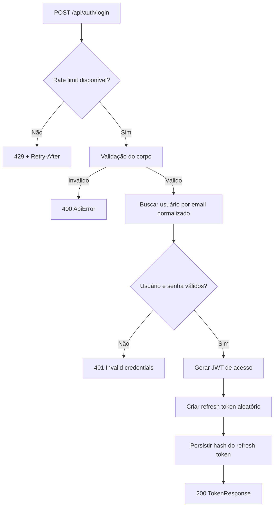
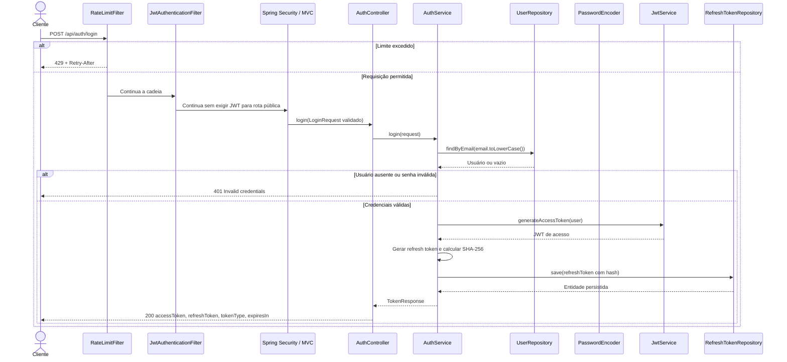

# Mapeamento de fluxo

Mapeamento de fluxo de um microserviço ou lib

## Escopo

- Projeto: `projeto-1`
- Serviço ou biblioteca: `microservice_auth_java`
- Repositório: `dominios/projeto-1/srvs/microservice_auth_java`
- Endpoint ou operação: `POST /api/auth/login`
- Branch: `main`

## Entradas

- Método e caminho do endpoint de entrada: `POST /api/auth/login`
- Sem parâmetros de rota e sem parâmetros de query
- Corpo JSON obrigatório com os campos `email` e `password`
- `email` deve ter formato válido; `password` deve estar presente e não vazia
- Header `Content-Type: application/json`
- Autenticação Bearer não é requerida; a rota ` /api/auth/** ` é pública
- Fontes: `src/main/java/com/miraluh/authservice/auth/AuthController.java`, `src/main/java/com/miraluh/authservice/auth/dto/LoginRequest.java`, `src/main/java/com/miraluh/authservice/config/SecurityConfig.java`

## Contratos

- Request de entrada: `POST /api/auth/login`, sem path params e sem query params; headers observados: `Content-Type: application/json`; corpo com `email` e `password` obrigatórios e não vazios
- Response de saída: `200 OK` com `TokenResponse` contendo `accessToken`, `refreshToken`, `tokenType=Bearer` e `expiresIn` em segundos; `expiresIn=900` foi confirmado por teste e corresponde ao padrão de 15 minutos, com possibilidade de sobrescrita por configuração
- O controller não declara `produces` nem header de sucesso explícito; a resposta é serializada pelo Spring MVC
- Erros retornam `ApiError` com `timestamp`, `status`, `error`, `message` e `path`
- Nenhuma chamada HTTP downstream; PostgreSQL e Redis são usados internamente
- Fontes: `src/main/java/com/miraluh/authservice/auth/dto/TokenResponse.java`, `src/main/resources/application.yml`, `src/test/java/com/miraluh/authservice/BaseIntegrationTest.java`, `src/main/java/com/miraluh/authservice/exception/ApiError.java`

## Chamada cURL observada

```sh
curl -X POST http://localhost:8080/api/auth/login \
  -H "Content-Type: application/json" \
  -d '{"email":"teste@miraluh.dev","password":"senha1234"}'
```

## Fluxo interno

1. O `RateLimitFilter` executa antes do JWT e aplica limite ao `POST /api/auth/login` com chave por prefixo/caminho/IP; a capacidade padrão é 5 e o refill é de 1 minuto, com uso de forwarded IP apenas quando `trust-forwarded-for` está habilitado; ao exceder, retorna `429` com `Retry-After`.
2. O filtro JWT continua a cadeia sem exigir token para esta rota pública.
3. O controller recebe o corpo validado e chama `AuthService.login`.
4. O `AuthService` normaliza o email para minúsculas e busca o usuário; ausência de usuário, hash nulo ou senha incompatível resulta em `BadCredentialsException`.
5. Em sucesso, `issueTokenPair` gera JWT de acesso, cria um refresh token aleatório e persiste apenas o hash SHA-256 via `RefreshTokenRepository`.
6. O JWT usa HS256 com claims `sub` com UUID do usuário, `jti`, `email`, `roles`, `iat` e `exp`; o refresh bruto é URL-safe sem padding.
7. O login não bloqueia `emailVerified=false`; nenhuma regra de verificação específica foi localizada.

## Fluxograma



## Diagrama de Sequencia



## Erros e excecoes

- `400 Bad Request` para corpo inválido, `email` fora de formato e `password` vazia; JSON malformado não foi confirmado em teste específico
- `401 Unauthorized` quando o email não existe, o hash está nulo ou a senha está incorreta; a mensagem é uniforme
- `429 Too Many Requests` quando o limite é excedido; a resposta inclui `Retry-After` e `ApiError`
- `500 Internal Server Error` para exceções não tratadas; o handler global registra `ERROR` com método, URI e stacktrace
- Falhas específicas de Redis e PostgreSQL ficaram `PENDENTE` porque não foram validadas em runtime
- Fontes: `src/main/java/com/miraluh/authservice/exception/GlobalExceptionHandler.java`, `src/main/java/com/miraluh/authservice/exception/ApiError.java`, `src/test/java/com/miraluh/authservice/AuthFlowIntegrationTest.java`, `src/test/java/com/miraluh/authservice/RateLimitIntegrationTest.java`

## Observabilidade

- Logs, métricas, traces e identificadores de correlação encontrados: não há log específico de sucesso ou falha do login; existe DEBUG para `com.miraluh.authservice` no perfil dev; o handler global registra exceções não tratadas como `ERROR` com método, URI e stacktrace; não foram localizadas métricas, traces ou correlation ID específicos do endpoint
- Fontes: `src/main/resources/application-dev.yml`, `src/main/java/com/miraluh/authservice/exception/GlobalExceptionHandler.java`, `src/main/resources/application.yml`
