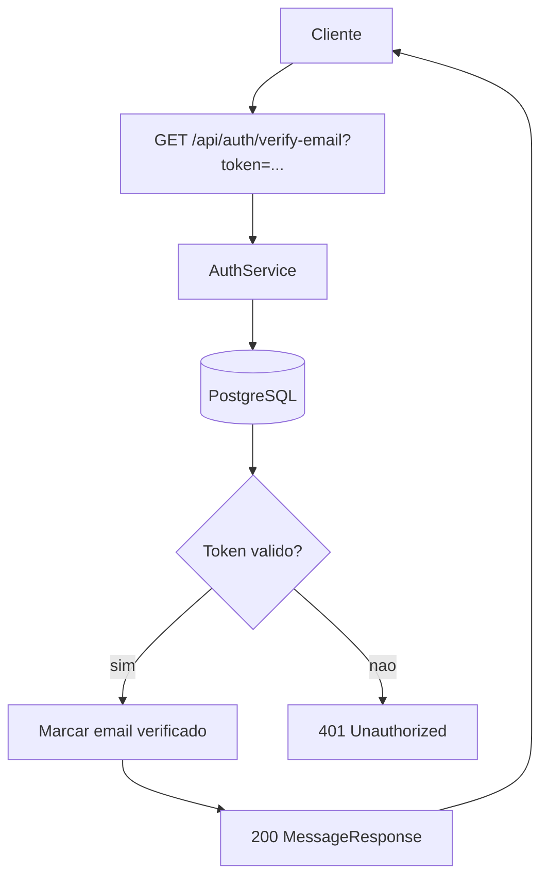
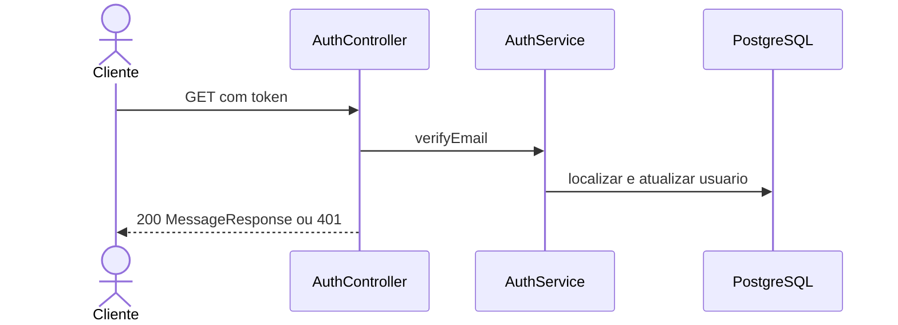

# Mapeamento de fluxo

## Escopo

- Projeto: `NAO APLICAVEL`
- Serviço ou biblioteca: `microservice_auth_java`
- Repositório: `dominios/srvs/microservice_auth_java`
- Endpoint ou operação: `GET /api/auth/verify-email`
- Branch: `main`

## Entradas

- Método e caminho: `GET /api/auth/verify-email`
- Parâmetros de rota, query e corpo: `Query obrigatoria token; sem payload`
- Autenticação e autorização: `Sem autenticacao`

## Contratos

### Requisição

- Método: `GET`
- Caminho: `/api/auth/verify-email`
- Parâmetros: `token=<verification-token>`
- Headers: `NAO APLICAVEL`
- Payload JSON: `NAO APLICAVEL`

### Resposta

- Status HTTP: `200`
- Payload JSON:

```json
{
  "message": "Email verified"
}
```

## Chamada cURL (Bruno)

```sh
curl --request GET \
  --url 'http://localhost:8080/api/auth/verify-email?token=<verification-token>'
```

## Fluxo interno

Busca o token de verificacao e valida sua expiracao. Quando valido, marca o email como verificado e limpa token e expiracao do usuario.

## Fluxograma



## Diagrama de Sequencia



## Comunicações e dependências

- Serviços e bibliotecas envolvidos: `PostgreSQL`
- Eventos e estados: `Email do usuario marcado como verificado`
- Processos assíncronos ou externos: `NAO LOCALIZADO`

## Erros e excecoes

- `401 token invalido ou expirado`
- `NAO VERIFICADO parametro ausente`
- `500 erro inesperado`

## Observabilidade

- Logs, métricas, traces e identificadores de correlação: `Logs especificos e correlacao NAO LOCALIZADO`
