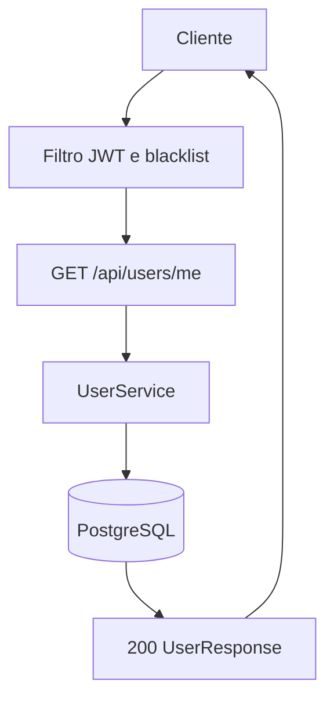
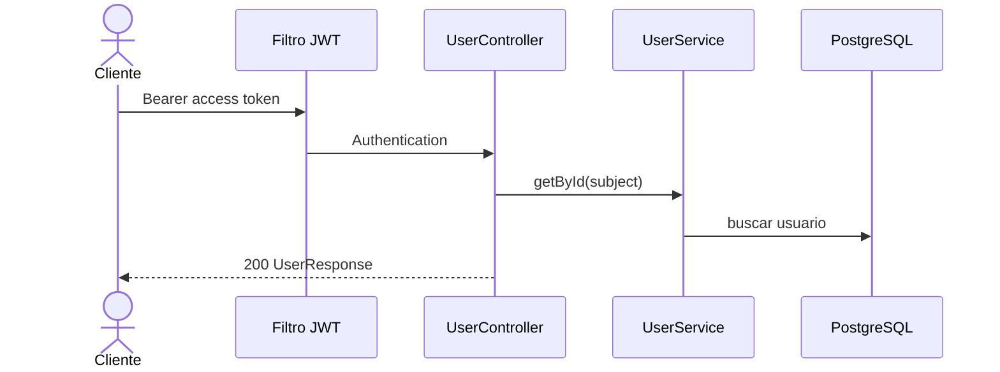

# Mapeamento de fluxo

## Escopo

- Projeto: `NAO APLICAVEL`
- Serviço ou biblioteca: `microservice_auth_java`
- Repositório: `dominios/srvs/microservice_auth_java`
- Endpoint ou operação: `GET /api/users/me`
- Branch: `main`

## Entradas

- Método e caminho: `GET /api/users/me`
- Parâmetros de rota, query e corpo: `Sem parametros de rota, query ou payload`
- Autenticação e autorização: `Authorization: Bearer <access-token>`

## Contratos

### Requisição

- Método: `GET`
- Caminho: `/api/users/me`
- Parâmetros: `NAO APLICAVEL`
- Headers: `Authorization: Bearer <access-token>`
- Payload JSON: `NAO APLICAVEL`

### Resposta

- Status HTTP: `200`
- Payload JSON:

```json
{
  "id": "<uuid>",
  "email": "<email>",
  "name": "<nome>",
  "roles": ["<role>"],
  "emailVerified": false,
  "provider": "<provider>",
  "createdAt": "<timestamp>"
}
```

## Chamada cURL (Bruno)

```sh
curl --request GET \
  --url 'http://localhost:8080/api/users/me' \
  --header 'Authorization: Bearer <access-token>'
```

## Fluxo interno

O filtro JWT valida o token e a blacklist, o controller obtem o UUID do subject e o servico consulta o usuario em PostgreSQL.

## Fluxograma



## Diagrama de Sequencia



## Comunicações e dependências

- Serviços e bibliotecas envolvidos: `Validacao JWT, Redis para blacklist e PostgreSQL`
- Eventos e estados: `Consulta do usuario autenticado por subject`
- Processos assíncronos ou externos: `NAO LOCALIZADO`

## Erros e excecoes

- `401 autenticacao ausente, invalida, expirada ou token em blacklist`
- `404 usuario nao encontrado`
- `500 erro inesperado`

## Observabilidade

- Logs, métricas, traces e identificadores de correlação: `Logs especificos e correlacao NAO LOCALIZADO`
