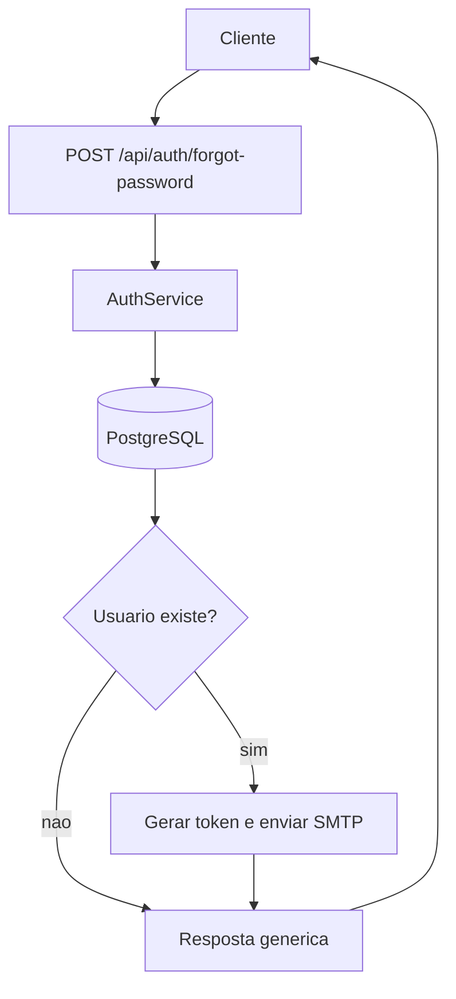
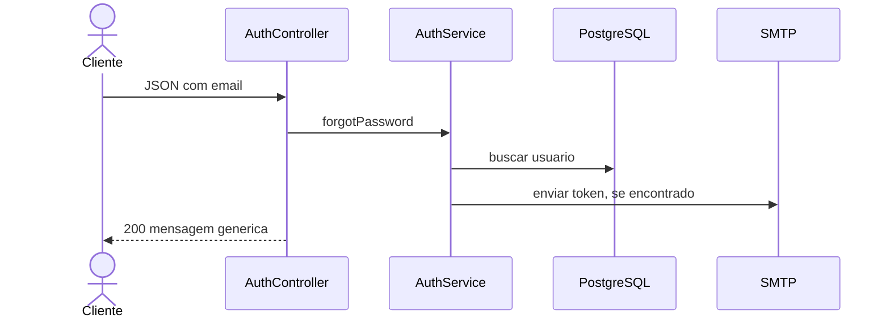

# Mapeamento de fluxo

## Escopo

- Projeto: `NAO APLICAVEL`
- Serviço ou biblioteca: `microservice_auth_java`
- Repositório: `dominios/srvs/microservice_auth_java`
- Endpoint ou operação: `POST /api/auth/forgot-password`
- Branch: `main`

## Entradas

- Método e caminho: `POST /api/auth/forgot-password`
- Parâmetros de rota, query e corpo: `Sem parametros de rota ou query; corpo JSON com email obrigatorio valido`
- Autenticação e autorização: `Sem autenticacao`

## Contratos

### Requisição

- Método: `POST`
- Caminho: `/api/auth/forgot-password`
- Parâmetros: `NAO APLICAVEL`
- Headers: `Content-Type: application/json`
- Payload JSON:

```json
{
  "email": "teste@miraluh.dev"
}
```

### Resposta

- Status HTTP: `200`
- Payload JSON:

```json
{
  "message": "If the email exists, a reset link has been sent"
}
```

## Chamada cURL (Bruno)

```sh
curl --request POST \
  --url 'http://localhost:8080/api/auth/forgot-password' \
  --header 'Content-Type: application/json' \
  --data-raw '{
    "email": "teste@miraluh.dev"
  }'
```

## Fluxo interno

Procura o email informado. Se existir, gera token valido por 30 minutos e solicita envio SMTP; a resposta e igual para email existente ou nao.

## Fluxograma



## Diagrama de Sequencia



## Comunicações e dependências

- Serviços e bibliotecas envolvidos: `PostgreSQL e SMTP`
- Eventos e estados: `Token de reset valido por 30 minutos quando usuario existe`
- Processos assíncronos ou externos: `Envio SMTP chamado diretamente no fluxo`

## Erros e excecoes

- `400 validacao`
- `429 rate limit`
- `500 erro inesperado`

## Observabilidade

- Logs, métricas, traces e identificadores de correlação: `Falha SMTP e logada; metricas, traces e correlacao NAO LOCALIZADO`
