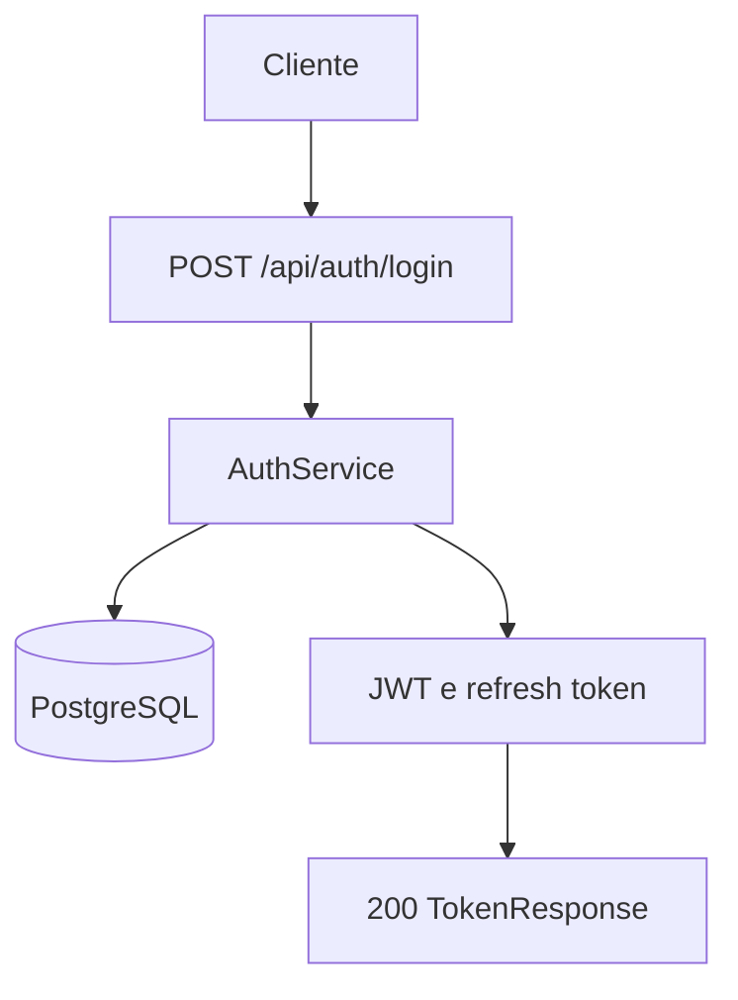
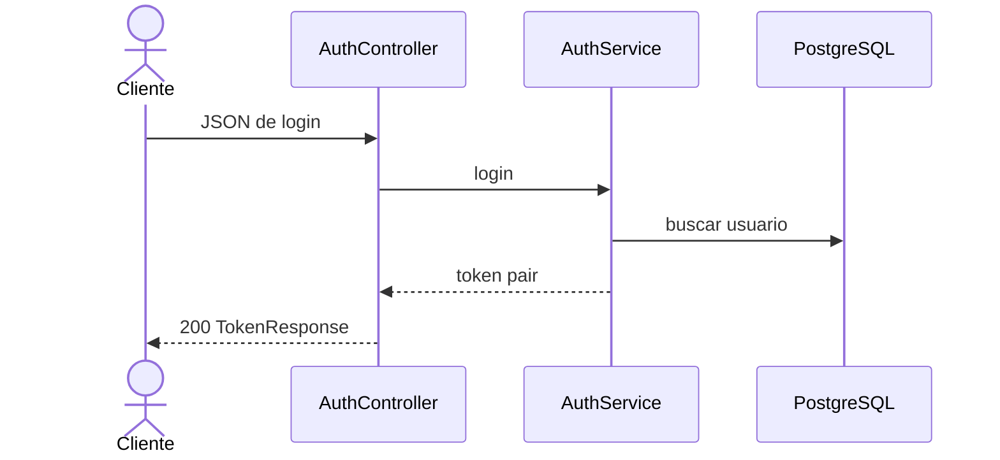

# Mapeamento de fluxo

## Escopo

- Projeto: `NAO APLICAVEL`
- Serviço ou biblioteca: `microservice_auth_java`
- Repositório: `dominios/srvs/microservice_auth_java`
- Endpoint ou operação: `POST /api/auth/login`
- Branch: `main`

## Entradas

- Método e caminho: `POST /api/auth/login`
- Parâmetros de rota, query e corpo: `Sem parametros de rota ou query; corpo JSON com email valido e senha nao vazia`
- Autenticação e autorização: `Sem autenticacao`

## Contratos

### Requisição

- Método: `POST`
- Caminho: `/api/auth/login`
- Parâmetros: `NAO APLICAVEL`
- Headers: `Content-Type: application/json`
- Payload JSON:

```json
{
  "email": "teste@miraluh.dev",
  "password": "senha1234"
}
```

### Resposta

- Status HTTP: `200`
- Payload JSON:

```json
{
  "accessToken": "<jwt>",
  "refreshToken": "<refresh-token>",
  "tokenType": "Bearer",
  "expiresIn": 900
}
```

## Chamada cURL (Bruno)

```sh
curl --request POST \
  --url 'http://localhost:8080/api/auth/login' \
  --header 'Content-Type: application/json' \
  --data-raw '{
    "email": "teste@miraluh.dev",
    "password": "senha1234"
  }'
```

## Fluxo interno

Busca o usuario por email, verifica a senha e emite JWT e refresh token. O refresh token e persistido com hash em PostgreSQL.

## Fluxograma



## Diagrama de Sequencia



## Comunicações e dependências

- Serviços e bibliotecas envolvidos: `PostgreSQL, BCrypt e JWT`
- Eventos e estados: `Refresh token persistido com hash`
- Processos assíncronos ou externos: `NAO LOCALIZADO`

## Erros e excecoes

- `400 validacao`
- `401 credenciais invalidas`
- `429 rate limit`
- `500 erro inesperado`

## Observabilidade

- Logs, métricas, traces e identificadores de correlação: `NAO LOCALIZADO`
