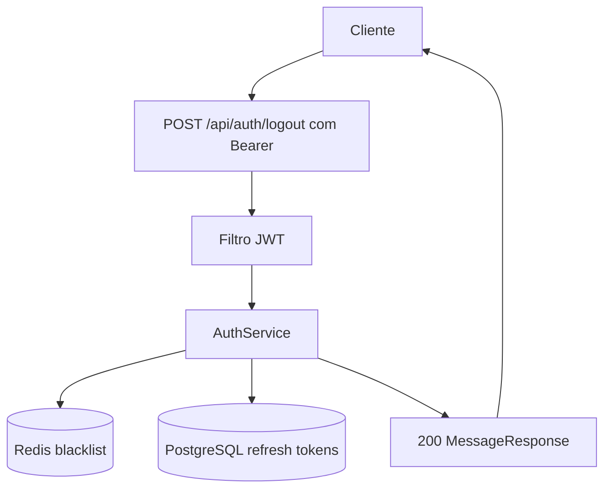
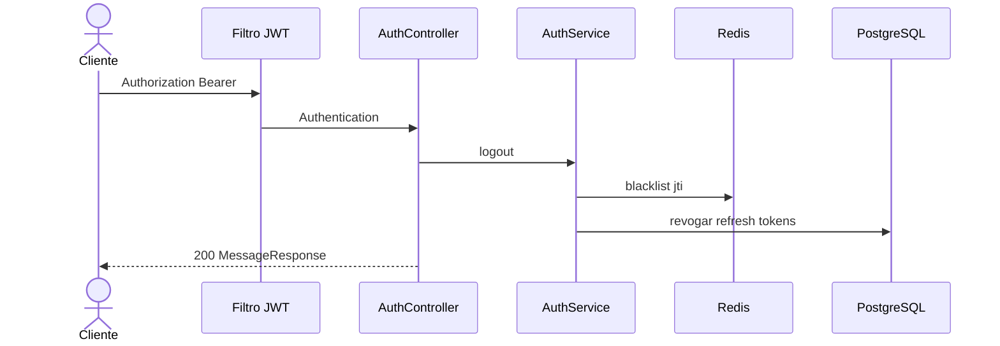

# Mapeamento de fluxo

## Escopo

- Projeto: `NAO APLICAVEL`
- Serviço ou biblioteca: `microservice_auth_java`
- Repositório: `dominios/srvs/microservice_auth_java`
- Endpoint ou operação: `POST /api/auth/logout`
- Branch: `main`

## Entradas

- Método e caminho: `POST /api/auth/logout`
- Parâmetros de rota, query e corpo: `Sem parametros de rota, query ou payload`
- Autenticação e autorização: `Authorization: Bearer <access-token>`

## Contratos

### Requisição

- Método: `POST`
- Caminho: `/api/auth/logout`
- Parâmetros: `NAO APLICAVEL`
- Headers: `Authorization: Bearer <access-token>`
- Payload JSON: `NAO APLICAVEL`

### Resposta

- Status HTTP: `200`
- Payload JSON:

```json
{
  "message": "Logged out"
}
```

## Chamada cURL (Bruno)

```sh
curl --request POST \
  --url 'http://localhost:8080/api/auth/logout' \
  --header 'Authorization: Bearer <access-token>'
```

## Fluxo interno

O filtro JWT valida o token e a blacklist. O controller obtem o JWT autenticado, adiciona o jti na blacklist Redis ate expirar e revoga os refresh tokens do usuario em PostgreSQL.

## Fluxograma



## Diagrama de Sequencia



## Comunicações e dependências

- Serviços e bibliotecas envolvidos: `Redis e PostgreSQL`
- Eventos e estados: `JWT em blacklist e refresh tokens revogados`
- Processos assíncronos ou externos: `NAO LOCALIZADO`

## Erros e excecoes

- `401 autenticacao ausente, invalida, expirada ou token em blacklist`
- `500 erro inesperado`

## Observabilidade

- Logs, métricas, traces e identificadores de correlação: `Log especifico de logout; metricas, traces e correlacao NAO LOCALIZADO`
