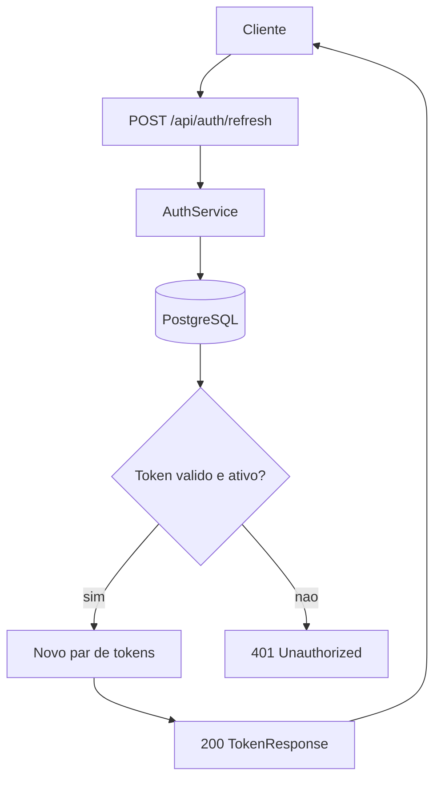
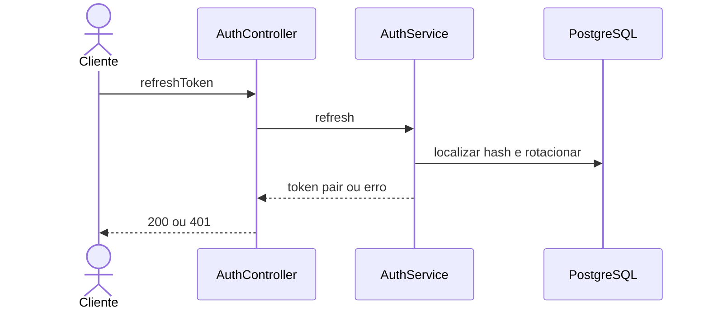

# Mapeamento de fluxo

## Escopo

- Projeto: `NAO APLICAVEL`
- Serviço ou biblioteca: `microservice_auth_java`
- Repositório: `dominios/srvs/microservice_auth_java`
- Endpoint ou operação: `POST /api/auth/refresh`
- Branch: `main`

## Entradas

- Método e caminho: `POST /api/auth/refresh`
- Parâmetros de rota, query e corpo: `Sem parametros de rota ou query; corpo JSON com refreshToken nao vazio`
- Autenticação e autorização: `Sem autenticacao Bearer`

## Contratos

### Requisição

- Método: `POST`
- Caminho: `/api/auth/refresh`
- Parâmetros: `NAO APLICAVEL`
- Headers: `Content-Type: application/json`
- Payload JSON:

```json
{
  "refreshToken": "<refresh-token>"
}
```

### Resposta

- Status HTTP: `200`
- Payload JSON:

```json
{
  "accessToken": "<jwt>",
  "refreshToken": "<novo-refresh-token>",
  "tokenType": "Bearer",
  "expiresIn": 900
}
```

## Chamada cURL (Bruno)

```sh
curl --request POST \
  --url 'http://localhost:8080/api/auth/refresh' \
  --header 'Content-Type: application/json' \
  --data-raw '{
    "refreshToken": "<refresh-token>"
  }'
```

## Fluxo interno

Calcula hash SHA-256 e busca o token, rejeitando casos invalidos, expirados ou revogados. Quando o token e valido, rotaciona o refresh token e gera novo par; quando revogado, revoga a cadeia do usuario.

## Fluxograma



## Diagrama de Sequencia



## Comunicações e dependências

- Serviços e bibliotecas envolvidos: `PostgreSQL, SHA-256 e JWT`
- Eventos e estados: `Rotacao de token e revogacao de cadeia quando necessario`
- Processos assíncronos ou externos: `NAO LOCALIZADO`

## Erros e excecoes

- `400 validacao`
- `401 token invalido, expirado ou reutilizado`
- `500 erro inesperado`

## Observabilidade

- Logs, métricas, traces e identificadores de correlação: `Deteccao de reuso gera log warn; metricas, traces e correlacao NAO LOCALIZADO`
