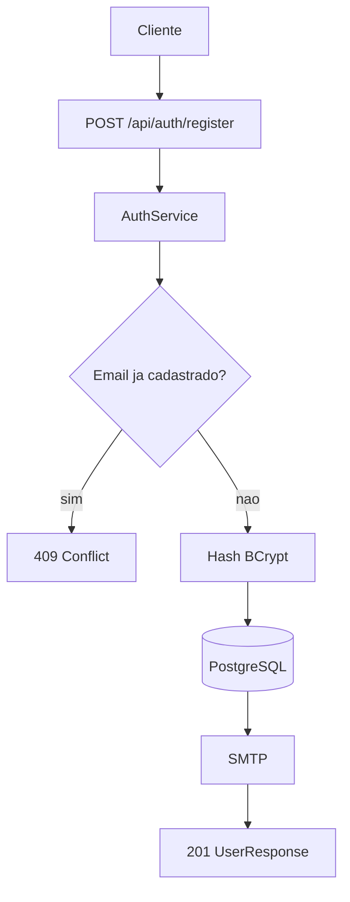
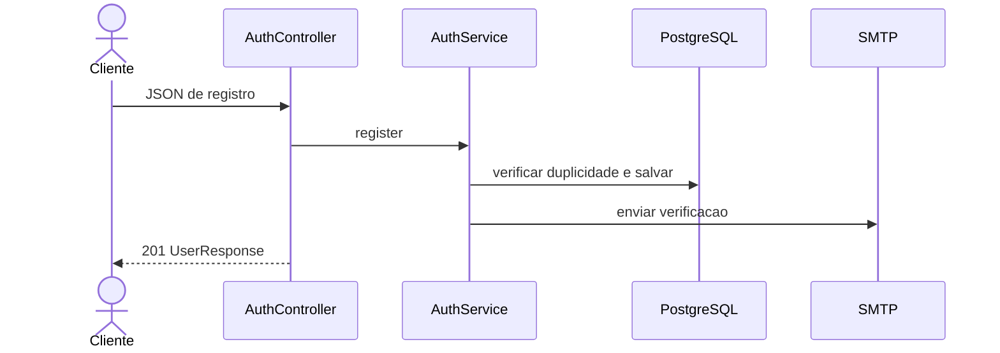

# Mapeamento de fluxo

## Escopo

- Projeto: `NAO APLICAVEL`
- Serviço ou biblioteca: `microservice_auth_java`
- Repositório: `dominios/srvs/microservice_auth_java`
- Endpoint ou operação: `POST /api/auth/register`
- Branch: `main`

## Entradas

- Método e caminho: `POST /api/auth/register`
- Parâmetros de rota, query e corpo: `Sem parametros de rota ou query; corpo JSON com email valido, senha de 8-128 caracteres e nome de ate 100 caracteres`
- Autenticação e autorização: `Sem autenticacao`

## Contratos

### Requisição

- Método: `POST`
- Caminho: `/api/auth/register`
- Parâmetros: `NAO APLICAVEL`
- Headers: `Content-Type: application/json`
- Payload JSON:

```json
{
  "email": "teste@miraluh.dev",
  "password": "senha1234",
  "name": "Bruno"
}
```

### Resposta

- Status HTTP: `201`
- Payload JSON:

```json
{
  "id": "<uuid>",
  "email": "<email>",
  "name": "<nome>",
  "roles": ["<role>"],
  "emailVerified": false,
  "provider": "<provider>",
  "createdAt": "<timestamp>"
}
```

## Chamada cURL (Bruno)

```sh
curl --request POST \
  --url 'http://localhost:8080/api/auth/register' \
  --header 'Content-Type: application/json' \
  --data-raw '{
    "email": "teste@miraluh.dev",
    "password": "senha1234",
    "name": "Bruno"
  }'
```

## Fluxo interno

Normaliza o email, verifica duplicidade, aplica hash BCrypt, salva usuario e token de verificacao com validade de 24h e solicita envio de email SMTP. Se o email ja existir, a rota responde conflito.

## Fluxograma



## Diagrama de Sequencia



## Comunicações e dependências

- Serviços e bibliotecas envolvidos: `PostgreSQL, BCrypt e SMTP`
- Eventos e estados: `Token de verificacao salvo com validade de 24h`
- Processos assíncronos ou externos: `Envio de email SMTP chamado diretamente no fluxo`

## Erros e excecoes

- `400 validacao`
- `409 email ja cadastrado`
- `429 rate limit`
- `500 erro inesperado`

## Observabilidade

- Logs, métricas, traces e identificadores de correlação: `Falha de SMTP e registrada; metricas, traces e correlacao NAO LOCALIZADO`
