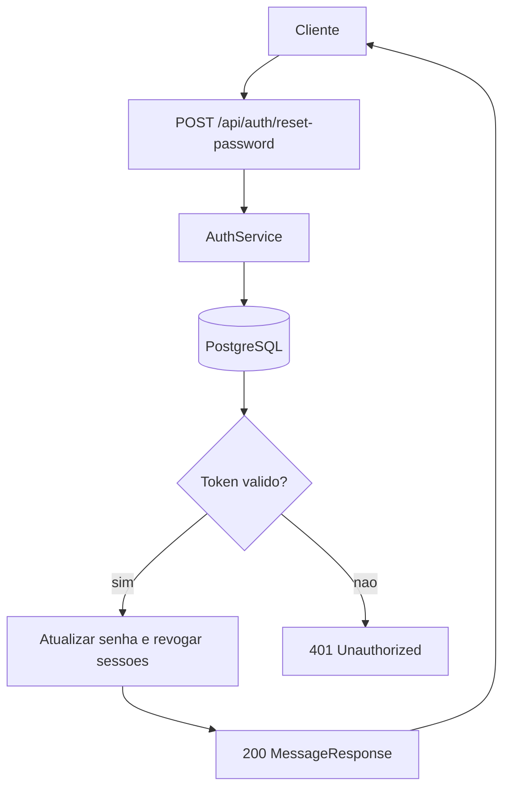
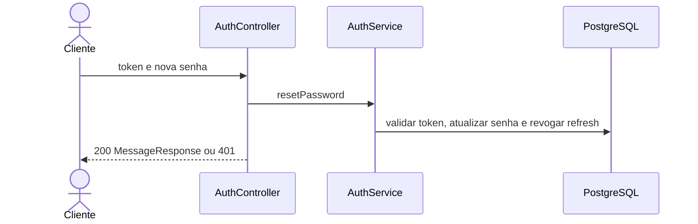

# Mapeamento de fluxo

## Escopo

- Projeto: `NAO APLICAVEL`
- Serviço ou biblioteca: `microservice_auth_java`
- Repositório: `dominios/srvs/microservice_auth_java`
- Endpoint ou operação: `POST /api/auth/reset-password`
- Branch: `main`

## Entradas

- Método e caminho: `POST /api/auth/reset-password`
- Parâmetros de rota, query e corpo: `Sem parametros de rota ou query; corpo JSON com token obrigatorio e nova senha de 8-128 caracteres`
- Autenticação e autorização: `Sem autenticacao`

## Contratos

### Requisição

- Método: `POST`
- Caminho: `/api/auth/reset-password`
- Parâmetros: `NAO APLICAVEL`
- Headers: `Content-Type: application/json`
- Payload JSON:

```json
{
  "token": "<reset-token>",
  "newPassword": "novaSenha123"
}
```

### Resposta

- Status HTTP: `200`
- Payload JSON:

```json
{
  "message": "Password updated"
}
```

## Chamada cURL (Bruno)

```sh
curl --request POST \
  --url 'http://localhost:8080/api/auth/reset-password' \
  --header 'Content-Type: application/json' \
  --data-raw '{
    "token": "<reset-token>",
    "newPassword": "novaSenha123"
  }'
```

## Fluxo interno

Localiza e valida a expiracao do token, atualiza o hash BCrypt da senha, limpa o token e revoga os refresh tokens do usuario.

## Fluxograma



## Diagrama de Sequencia



## Comunicações e dependências

- Serviços e bibliotecas envolvidos: `PostgreSQL e BCrypt`
- Eventos e estados: `Senha atualizada e refresh tokens revogados`
- Processos assíncronos ou externos: `NAO LOCALIZADO`

## Erros e excecoes

- `400 validacao`
- `401 token invalido ou expirado`
- `500 erro inesperado`

## Observabilidade

- Logs, métricas, traces e identificadores de correlação: `Logs especificos e correlacao NAO LOCALIZADO`
