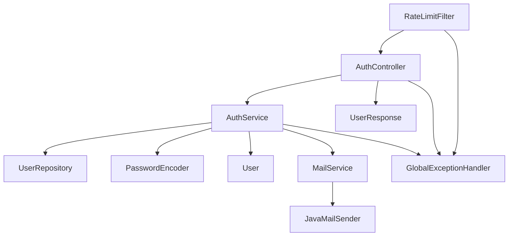
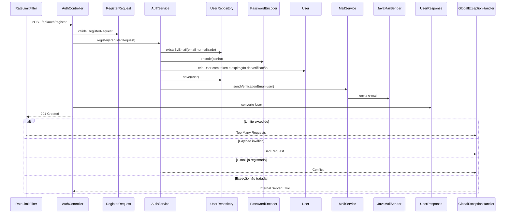

# POST /api/auth/register

## Evidence
- [dominios/srvs/microservice_auth_java/src/main/java/com/miraluh/authservice/auth/AuthController.java](dominios/srvs/microservice_auth_java/src/main/java/com/miraluh/authservice/auth/AuthController.java#L38-L42)
- [dominios/srvs/microservice_auth_java/src/main/java/com/miraluh/authservice/auth/AuthService.java](dominios/srvs/microservice_auth_java/src/main/java/com/miraluh/authservice/auth/AuthService.java#L69-L84)

## Steps
1. AuthController recebe RegisterRequest validado.
2. AuthService normaliza o e-mail, verifica duplicidade, codifica a senha, cria o usuário e salva via UserRepository.
3. MailService envia o e-mail de verificação.
4. Retorna HTTP 201 com UserResponse.

## Errors
- **E-mail já cadastrado** — HTTP 409 — [dominios/srvs/microservice_auth_java/src/main/java/com/miraluh/authservice/exception/EmailAlreadyUsedException.java](dominios/srvs/microservice_auth_java/src/main/java/com/miraluh/authservice/exception/EmailAlreadyUsedException.java#L5-L9)
- **Payload inválido** — HTTP 400 — [dominios/srvs/microservice_auth_java/src/main/java/com/miraluh/authservice/exception/GlobalExceptionHandler.java](dominios/srvs/microservice_auth_java/src/main/java/com/miraluh/authservice/exception/GlobalExceptionHandler.java#L31-L41)
- **Limite de requisições excedido** — HTTP 429 — [dominios/srvs/microservice_auth_java/src/main/java/com/miraluh/authservice/security/RateLimitFilter.java](dominios/srvs/microservice_auth_java/src/main/java/com/miraluh/authservice/security/RateLimitFilter.java#L24-L31)

## Dependencies
- UserRepository
- PasswordEncoder BCrypt
- MailService
- Banco de dados relacional
- SMTP

## Config
- `app.security.bcrypt-strength`: usado pelo PasswordEncoder
- `app.base-url`: usado no link de verificação
- `app.mail.from`: remetente do e-mail
- `app.rate-limit.capacity`: limite configurável
- `app.rate-limit.refill-period`: período de reposição configurável

## Participants
- AuthController
- AuthService
- UserRepository
- PasswordEncoder
- MailService

## Unknowns
- {}

# Fluxo — POST /api/auth/register

## Objetivo

Registrar um usuário quando o e-mail ainda não existir, aplicar a senha, gerar token de verificação e enviar o e-mail.

## Entrada

* `POST /api/auth/register`
* Payload validado: `RegisterRequest`

## Flowchart

## Sequence

## Dependências

* PostgreSQL via datasource/JPA e UserRepository
* Redis via Bucket4j ProxyManager para rate limiting
* SMTP via JavaMailSender

## Saída

* `HTTP 201`
* `HTTP 429 Too Many Requests com Retry-After`
* `HTTP 400 Bad Request com ApiError`
* `HTTP 409 Conflict`
* `HTTP 500 Internal Server Error`

## Pontos desconhecidos

* `email_delivery_result`: MailService captura MailException, registra log e não propaga erro; o resultado efetivo do provedor SMTP não é confirmado.
* `database_runtime_values`: Os valores efetivos de DATABASE_URL, DATABASE_USER e DATABASE_PASSWORD podem ser sobrescritos por ambiente.
