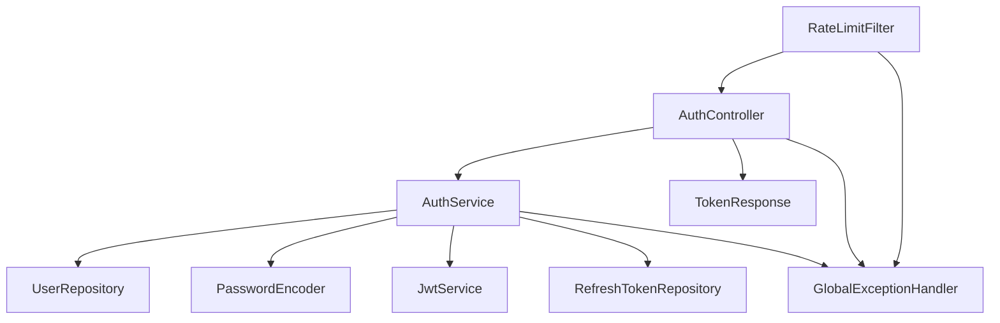
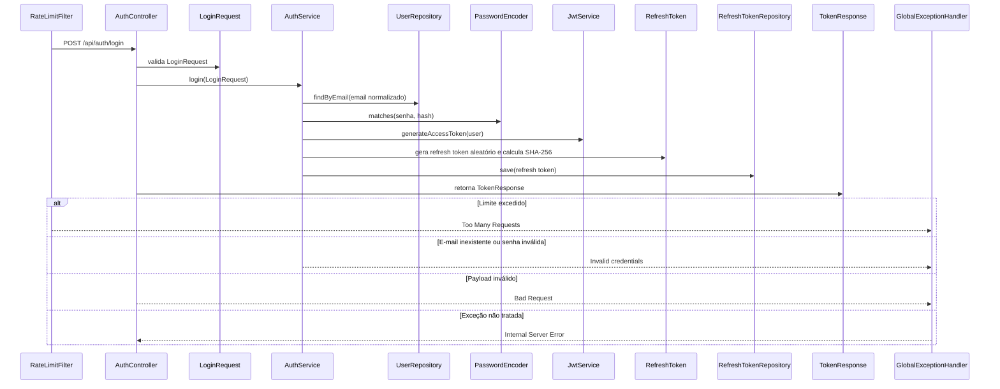

# POST /api/auth/login

## Evidence

- [dominios/srvs/microservice_auth_java/src/main/java/com/miraluh/authservice/auth/AuthController.java](dominios/srvs/microservice_auth_java/src/main/java/com/miraluh/authservice/auth/AuthController.java#L45-L48)
- [dominios/srvs/microservice_auth_java/src/main/java/com/miraluh/authservice/auth/AuthService.java](dominios/srvs/microservice_auth_java/src/main/java/com/miraluh/authservice/auth/AuthService.java#L86-L97)
- [dominios/srvs/microservice_auth_java/src/main/java/com/miraluh/authservice/auth/AuthService.java](dominios/srvs/microservice_auth_java/src/main/java/com/miraluh/authservice/auth/AuthService.java#L161-L175)

## Steps

1. AuthController recebe LoginRequest validado.
2. AuthService busca o usuário por e-mail normalizado e compara a senha com PasswordEncoder.
3. AuthService gera JWT de acesso, cria e persiste um refresh token hash.
4. Retorna TokenResponse com access token, refresh token, tipo Bearer e expiração.

## Errors

- **Usuário inexistente ou senha inválida** — HTTP 401 — [dominios/srvs/microservice_auth_java/src/main/java/com/miraluh/authservice/auth/AuthService.java](dominios/srvs/microservice_auth_java/src/main/java/com/miraluh/authservice/auth/AuthService.java#L87-L93)
- **Payload inválido** — HTTP 400 — [dominios/srvs/microservice_auth_java/src/main/java/com/miraluh/authservice/exception/GlobalExceptionHandler.java](dominios/srvs/microservice_auth_java/src/main/java/com/miraluh/authservice/exception/GlobalExceptionHandler.java#L31-L41)
- **Limite de requisições excedido** — HTTP 429 — [dominios/srvs/microservice_auth_java/src/main/java/com/miraluh/authservice/security/RateLimitFilter.java](dominios/srvs/microservice_auth_java/src/main/java/com/miraluh/authservice/security/RateLimitFilter.java#L24-L31)

## Dependencies

- UserRepository
- PasswordEncoder BCrypt
- JwtService
- RefreshTokenRepository
- Banco de dados relacional

## Config

- `app.jwt.secret`: configurado externamente; valor omitido
- `app.jwt.access-ttl`: TTL do access token
- `app.jwt.refresh-ttl`: TTL do refresh token
- `app.security.bcrypt-strength`: custo do BCrypt
- `app.rate-limit.capacity`: limite configurável
- `app.rate-limit.refill-period`: período de reposição configurável

## Participants

- AuthController
- AuthService
- UserRepository
- PasswordEncoder
- JwtService
- RefreshTokenRepository

## Unknowns

- {}

# Fluxo — POST /api/auth/login

## Objetivo

Autenticar com e-mail e senha, validar credenciais e emitir o par de tokens.

## Entrada

- `POST /api/auth/login`
- Payload validado: `LoginRequest`

## Flowchart

## Sequence

## Dependências

- PostgreSQL via UserRepository e RefreshTokenRepository
- Redis via Bucket4j ProxyManager para rate limiting

## Saída

- `TokenResponse`
- `HTTP 429 Too Many Requests`
- `HTTP 401 Unauthorized com mensagem Invalid credentials`
- `HTTP 400 Bad Request`

## Pontos desconhecidos

- `jwt_secret_runtime_value`: O segredo efetivo depende da variável JWT_SECRET ou do perfil ativo.
- `database_runtime_values`: Os valores efetivos da conexão PostgreSQL podem ser sobrescritos por ambiente.
