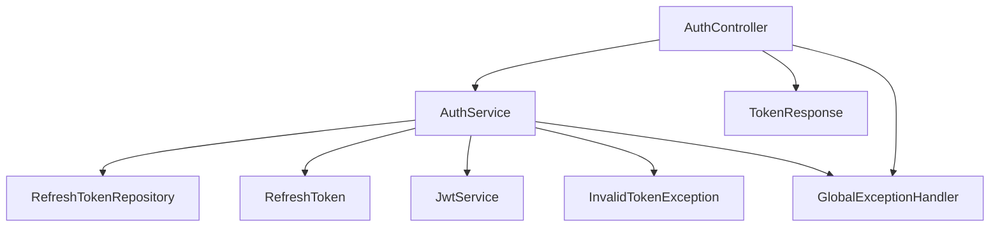
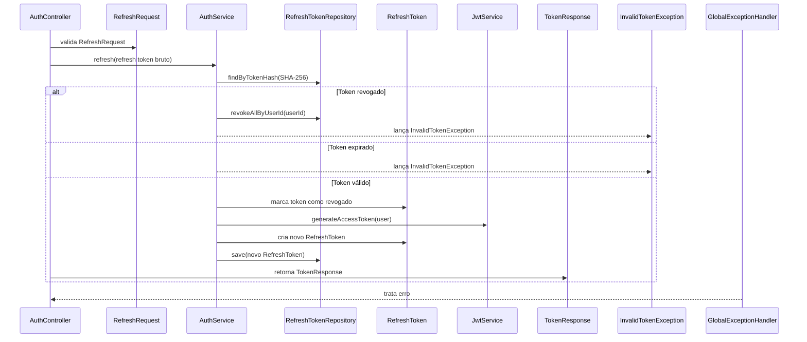

# POST /api/auth/refresh

## Evidence
- [dominios/srvs/microservice_auth_java/src/main/java/com/miraluh/authservice/auth/AuthController.java](dominios/srvs/microservice_auth_java/src/main/java/com/miraluh/authservice/auth/AuthController.java#L51-L54)
- [dominios/srvs/microservice_auth_java/src/main/java/com/miraluh/authservice/auth/AuthService.java](dominios/srvs/microservice_auth_java/src/main/java/com/miraluh/authservice/auth/AuthService.java#L99-L116)
- [dominios/srvs/microservice_auth_java/src/main/java/com/miraluh/authservice/auth/AuthService.java](dominios/srvs/microservice_auth_java/src/main/java/com/miraluh/authservice/auth/AuthService.java#L161-L175)

## Steps
1. AuthController recebe RefreshRequest validado.
2. AuthService calcula o hash do refresh token e busca o token persistido.
3. Rejeita token revogado ou expirado; para token revogado, revoga toda a cadeia do usuário.
4. Marca o token atual como revogado e emite novo par de tokens.
5. Retorna TokenResponse.

## Errors
- **Refresh token inexistente, revogado ou expirado** — HTTP 401 — [dominios/srvs/microservice_auth_java/src/main/java/com/miraluh/authservice/auth/AuthService.java](dominios/srvs/microservice_auth_java/src/main/java/com/miraluh/authservice/auth/AuthService.java#L99-L116)
- **Payload inválido** — HTTP 400 — [dominios/srvs/microservice_auth_java/src/main/java/com/miraluh/authservice/exception/GlobalExceptionHandler.java](dominios/srvs/microservice_auth_java/src/main/java/com/miraluh/authservice/exception/GlobalExceptionHandler.java#L31-L41)

## Dependencies
- RefreshTokenRepository
- JwtService
- Banco de dados relacional

## Config
- `app.jwt.secret`: configurado externamente; valor omitido
- `app.jwt.access-ttl`: TTL do access token
- `app.jwt.refresh-ttl`: TTL do refresh token

## Participants
- AuthController
- AuthService
- RefreshTokenRepository
- JwtService

## Unknowns
- {}
# Fluxo — POST /api/auth/refresh

## Objetivo

Trocar um refresh token bruto por um novo par de tokens quando o token consultado ainda é válido.

## Entrada

* `POST /api/auth/refresh`
* Payload validado: `RefreshRequest`

## Flowchart

## Sequence

## Dependências

* PostgreSQL via RefreshTokenRepository
* PostgreSQL via User associado ao RefreshToken

## Saída

* `TokenResponse`
* `HTTP 400 Bad Request`
* `HTTP 401 Unauthorized`

## Pontos desconhecidos

* `jwt_secret_runtime_value`: O segredo efetivo depende da configuração de ambiente.
* `database_runtime_values`: Os valores efetivos da conexão PostgreSQL não estão determinados apenas pelo código.
