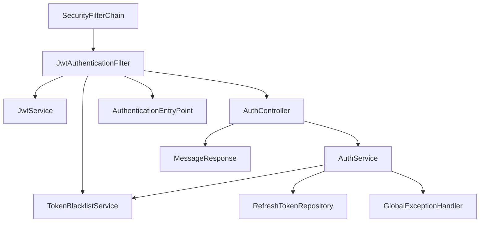
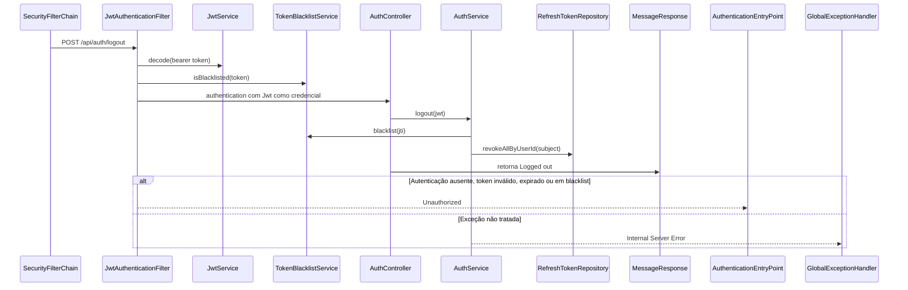

# POST /api/auth/logout

## Evidence
- [dominios/srvs/microservice_auth_java/src/main/java/com/miraluh/authservice/auth/AuthController.java](dominios/srvs/microservice_auth_java/src/main/java/com/miraluh/authservice/auth/AuthController.java#L57-L63)
- [dominios/srvs/microservice_auth_java/src/main/java/com/miraluh/authservice/auth/AuthService.java](dominios/srvs/microservice_auth_java/src/main/java/com/miraluh/authservice/auth/AuthService.java#L119-L124)
- [dominios/srvs/microservice_auth_java/src/main/java/com/miraluh/authservice/config/SecurityConfig.java](dominios/srvs/microservice_auth_java/src/main/java/com/miraluh/authservice/config/SecurityConfig.java#L47-L50)

## Steps
1. SecurityFilterChain exige autenticação.
2. AuthController obtém o JWT das credenciais autenticadas.
3. AuthService adiciona o identificador do JWT à blacklist pelo tempo restante e revoga os refresh tokens do usuário.
4. Retorna MessageResponse com 'Logged out'.

## Errors
- **Autenticação ausente ou token inválido** — HTTP 401 — [dominios/srvs/microservice_auth_java/src/main/java/com/miraluh/authservice/config/SecurityConfig.java](dominios/srvs/microservice_auth_java/src/main/java/com/miraluh/authservice/config/SecurityConfig.java#L68-L71)

## Dependencies
- JwtAuthenticationFilter
- TokenBlacklistService
- Redis
- RefreshTokenRepository
- Banco de dados relacional

## Config
- `app.jwt.secret`: configurado externamente; valor omitido
- `spring.data.redis.host`: host do Redis
- `spring.data.redis.port`: porta do Redis

## Participants
- SecurityFilterChain
- JwtAuthenticationFilter
- AuthController
- AuthService
- TokenBlacklistService
- RefreshTokenRepository

## Unknowns
- {}
# Fluxo — POST /api/auth/logout

## Objetivo

Revogar os refresh tokens do usuário autenticado e registrar o access token na blacklist.

## Entrada

* `POST /api/auth/logout`
* Authorization: `Bearer <access_token>`

## Flowchart

## Sequence

## Dependências

* Redis via StringRedisTemplate para blacklist
* PostgreSQL via RefreshTokenRepository

## Saída

* `MessageResponse`
* `HTTP 401 Unauthorized`
* `HTTP 500 Internal Server Error`

## Pontos desconhecidos

* `authentication_credentials_runtime`: A criação completa do Authentication depende da decodificação bem-sucedida do JWT e dos claims recebidos.
* `database_runtime_values`: A conexão PostgreSQL efetiva depende de configuração externa.
