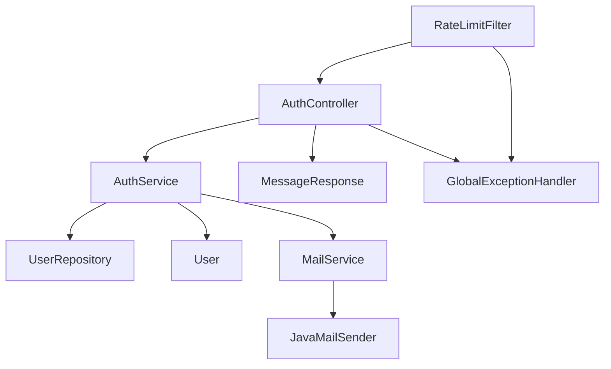
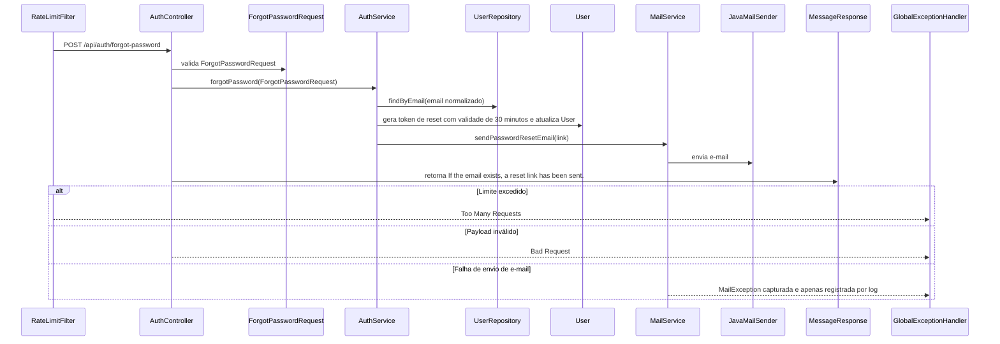

# POST /api/auth/forgot-password

## Evidence
- [dominios/srvs/microservice_auth_java/src/main/java/com/miraluh/authservice/auth/AuthController.java](dominios/srvs/microservice_auth_java/src/main/java/com/miraluh/authservice/auth/AuthController.java#L72-L75)
- [dominios/srvs/microservice_auth_java/src/main/java/com/miraluh/authservice/auth/AuthService.java](dominios/srvs/microservice_auth_java/src/main/java/com/miraluh/authservice/auth/AuthService.java#L141-L149)
- [dominios/srvs/microservice_auth_java/src/main/java/com/miraluh/authservice/mail/MailService.java](dominios/srvs/microservice_auth_java/src/main/java/com/miraluh/authservice/mail/MailService.java#L36-L47)

## Steps
1. AuthController recebe ForgotPasswordRequest validado.
2. AuthService busca o usuário pelo e-mail normalizado.
3. Quando encontrado, gera token de recuperação, define validade de 30 minutos e envia e-mail.
4. Retorna mensagem fixa independentemente da existência do e-mail.

## Errors
- **Payload inválido** — HTTP 400 — [dominios/srvs/microservice_auth_java/src/main/java/com/miraluh/authservice/exception/GlobalExceptionHandler.java](dominios/srvs/microservice_auth_java/src/main/java/com/miraluh/authservice/exception/GlobalExceptionHandler.java#L31-L41)
- **Limite de requisições excedido** — HTTP 429 — [dominios/srvs/microservice_auth_java/src/main/java/com/miraluh/authservice/security/RateLimitFilter.java](dominios/srvs/microservice_auth_java/src/main/java/com/miraluh/authservice/security/RateLimitFilter.java#L24-L31)

## Dependencies
- UserRepository
- MailService
- Banco de dados relacional
- SMTP

## Config
- `app.base-url`: usado no link de recuperação
- `app.mail.from`: remetente do e-mail
- `app.rate-limit.capacity`: limite configurável
- `app.rate-limit.refill-period`: período de reposição configurável

## Participants
- AuthController
- AuthService
- UserRepository
- MailService

## Unknowns
- {}
# Fluxo — POST /api/auth/forgot-password

## Objetivo

Gerar token de redefinição de senha e enviar o link por e-mail quando o usuário existe.

## Entrada

* `POST /api/auth/forgot-password`
* Payload validado: `ForgotPasswordRequest`

## Flowchart

## Sequence

## Dependências

* PostgreSQL via UserRepository
* Redis via Bucket4j ProxyManager para rate limiting
* SMTP via JavaMailSender

## Saída

* `MessageResponse`
* `HTTP 429 Too Many Requests`
* `HTTP 400 Bad Request`

## Pontos desconhecidos

* `email_delivery_result`: O provedor SMTP pode aceitar ou rejeitar a mensagem; MailService não propaga MailException.
* `database_runtime_values`: A conexão PostgreSQL efetiva depende de configuração externa.
