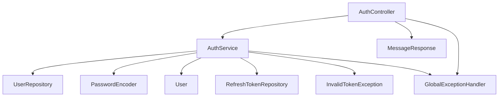
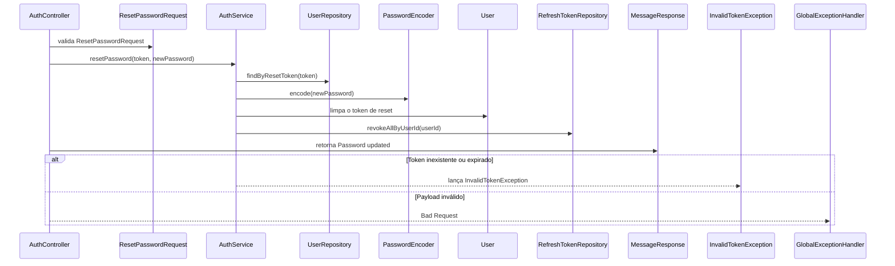

# POST /api/auth/reset-password

## Evidence
- [dominios/srvs/microservice_auth_java/src/main/java/com/miraluh/authservice/auth/AuthController.java](dominios/srvs/microservice_auth_java/src/main/java/com/miraluh/authservice/auth/AuthController.java#L78-L81)
- [dominios/srvs/microservice_auth_java/src/main/java/com/miraluh/authservice/auth/AuthService.java](dominios/srvs/microservice_auth_java/src/main/java/com/miraluh/authservice/auth/AuthService.java#L152-L160)

## Steps
1. AuthController recebe ResetPasswordRequest validado.
2. AuthService busca o usuário pelo token de recuperação.
3. Valida expiração, codifica a nova senha, limpa o token e revoga os refresh tokens do usuário.
4. Retorna MessageResponse com 'Password updated'.

## Errors
- **Token inexistente ou expirado** — HTTP 401 — [dominios/srvs/microservice_auth_java/src/main/java/com/miraluh/authservice/auth/AuthService.java](dominios/srvs/microservice_auth_java/src/main/java/com/miraluh/authservice/auth/AuthService.java#L153-L157)
- **Payload inválido** — HTTP 400 — [dominios/srvs/microservice_auth_java/src/main/java/com/miraluh/authservice/exception/GlobalExceptionHandler.java](dominios/srvs/microservice_auth_java/src/main/java/com/miraluh/authservice/exception/GlobalExceptionHandler.java#L31-L41)

## Dependencies
- UserRepository
- PasswordEncoder BCrypt
- RefreshTokenRepository
- Banco de dados relacional

## Config
- `app.security.bcrypt-strength`: custo do BCrypt
- `app.auth.reset-token-ttl`: não existe como configuração; TTL fixo de 30 minutos no código

## Participants
- AuthController
- AuthService
- UserRepository
- PasswordEncoder
- RefreshTokenRepository

## Unknowns
- {}
# Fluxo — POST /api/auth/reset-password

## Objetivo

Redefinir a senha com token de recuperação válido e revogar sessões ativas.

## Entrada

* `POST /api/auth/reset-password`
* Payload validado: `ResetPasswordRequest`

## Flowchart

## Sequence

## Dependências

* PostgreSQL via UserRepository
* PostgreSQL via RefreshTokenRepository

## Saída

* `MessageResponse`
* `HTTP 400 Bad Request`
* `HTTP 401 Unauthorized`

## Pontos desconhecidos

* `database_runtime_values`: A conexão PostgreSQL efetiva depende de configuração externa.
