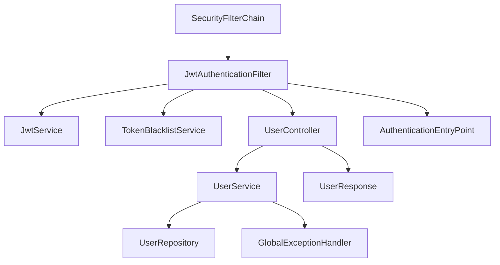
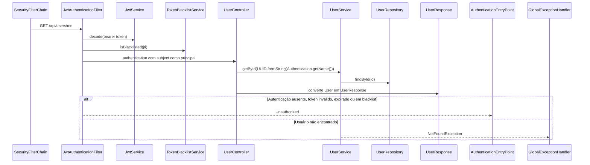

# GET /api/users/me

## Evidence
- [dominios/srvs/microservice_auth_java/src/main/java/com/miraluh/authservice/user/UserController.java](dominios/srvs/microservice_auth_java/src/main/java/com/miraluh/authservice/user/UserController.java#L22-L29)
- [dominios/srvs/microservice_auth_java/src/main/java/com/miraluh/authservice/user/UserService.java](dominios/srvs/microservice_auth_java/src/main/java/com/miraluh/authservice/user/UserService.java#L16-L22)
- [dominios/srvs/microservice_auth_java/src/main/java/com/miraluh/authservice/config/SecurityConfig.java](dominios/srvs/microservice_auth_java/src/main/java/com/miraluh/authservice/config/SecurityConfig.java#L54-L64)

## Steps
1. SecurityFilterChain exige autenticação para a rota.
2. UserController converte o subject autenticado em UUID.
3. UserService busca o usuário por ID via UserRepository.
4. Retorna UserResponse.

## Errors
- **Autenticação ausente ou token inválido** — HTTP 401 — [dominios/srvs/microservice_auth_java/src/main/java/com/miraluh/authservice/config/SecurityConfig.java](dominios/srvs/microservice_auth_java/src/main/java/com/miraluh/authservice/config/SecurityConfig.java#L68-L71)
- **Usuário não encontrado** — HTTP 404 — [dominios/srvs/microservice_auth_java/src/main/java/com/miraluh/authservice/user/UserService.java](dominios/srvs/microservice_auth_java/src/main/java/com/miraluh/authservice/user/UserService.java#L18-L21)

## Dependencies
- JwtAuthenticationFilter
- UserService
- UserRepository
- Banco de dados relacional

## Config
- `app.jwt.secret`: configurado externamente; valor omitido

## Participants
- SecurityFilterChain
- JwtAuthenticationFilter
- UserController
- UserService
- UserRepository

## Unknowns
- {}
# Fluxo — GET /api/users/me

## Objetivo

Retornar o perfil do usuário autenticado a partir do subject do JWT.

## Entrada

* `GET /api/users/me`
* Authorization: `Bearer <access_token>`

## Flowchart

## Sequence

## Dependências

* Redis via StringRedisTemplate para verificar blacklist
* PostgreSQL via UserRepository

## Saída

* `UserResponse`
* `HTTP 401 Unauthorized`
* `HTTP 404 Not Found`

## Pontos desconhecidos

* `authentication_subject_validity`: O código converte Authentication.getName() para UUID; não há validação explícita no controller para formato inválido.
* `database_runtime_values`: A conexão PostgreSQL efetiva depende de configuração externa.
